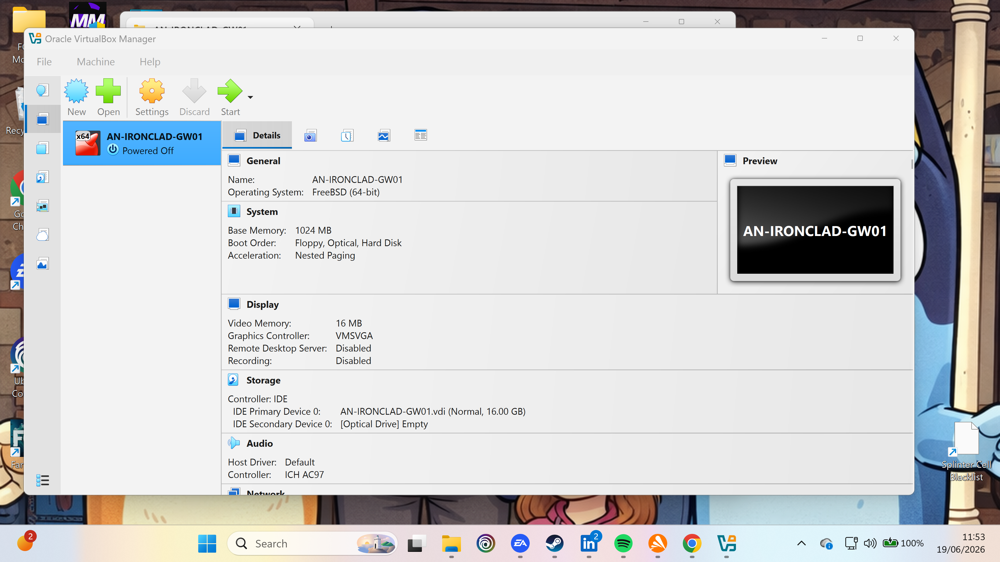
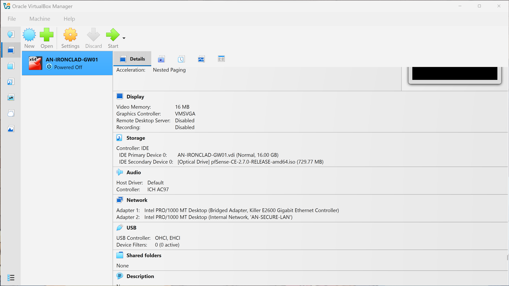
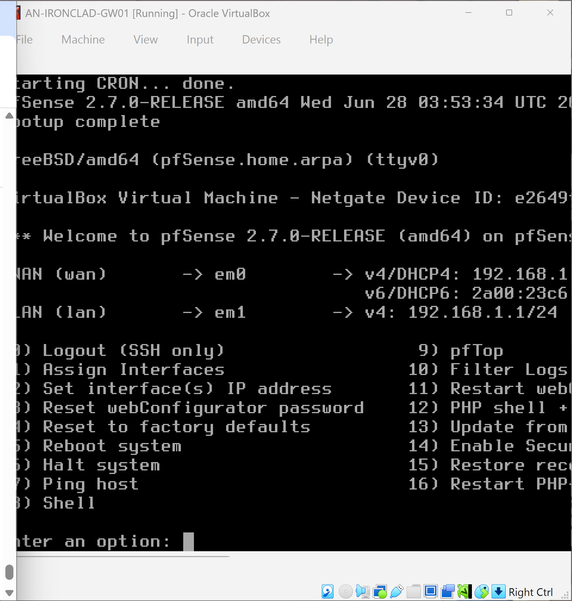

# Project Ironclad: SOHO Firewall & Perimeter Infrastructure

## 📁 Project Overview
In my own words: I created a WAN (Wide Area Network) and a LAN (Local Area Network) topology using an enterprise-sized firewall deployment. This firewall sits directly at the network perimeter boundary to protect our entire architecture. While the underlying text interface can seem complex, it acts as our fully automated secure base to shield our assets before expanding the office layout.

---

## 📸 Phase 1: Virtual Hardware Provisioning
* **CompTIA A+ Core 1 Target (Domain 4.1):** Configured a Type-2 hypervisor engine allocating 1GB base memory.

---

## 📸 Phase 2: Dual-Homed Network Configuration
* **CompTIA A+ Core 1 Target (Domain 2.2):** Established public WAN bridging alongside a private virtual network segment named `AN-SECURE-LAN`.

---

## 📸 Phase 3: Operating System Disk Installation
* **CompTIA A+ Core 2 Target (Domain 1.2):** Mounted the raw pfSense `.iso` installer, formatting virtual volume storage layout sectors.

---

## 📸 Phase 4: Final Live Production Verification
* **CompTIA A+ Core 1 Target (Domain 4.2):** Live verification of DHCP client leases and static network gateway parameters.

